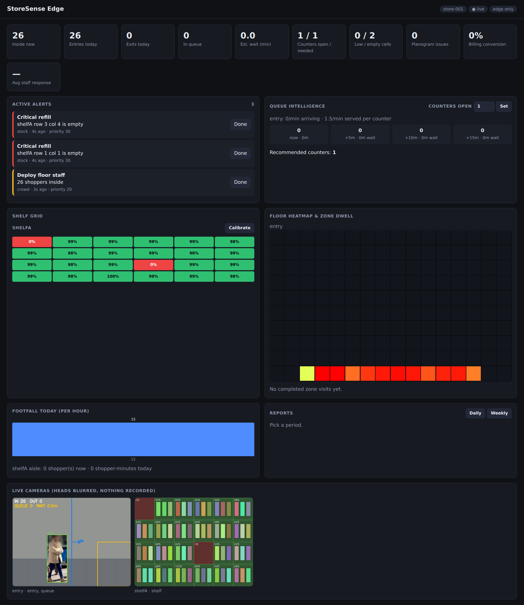

# StoreSense Edge

On-device retail intelligence for Indian stores: footfall, shelf stock and billing queues from ordinary cameras, with no cloud dependency and no stored personal data.

Built for **Smart India Hackathon 2026 — PS SIH26179** (AI-powered retail intelligence with edge AI).



## Why it's different

- **Grid mapping.** Everything is a grid. The floor is mapped top-down through a homography, so heatmaps and zone dwell times are in real floor space, not camera pixels. Each shelf face is a grid of cells, and each cell is the planogram slot for one product.
- **Opposite-shelf cameras.** Two cameras face each other across an aisle, each watching the *other* shelf head-on. That avoids steep viewing angles, and the same pair also sees shoppers in the aisle.
- **Occlusion-aware.** When a shopper blocks part of a shelf, those cells hold their last known state instead of reporting a false stock-out.
- **Runs offline.** Inference, storage and dashboard all live on the edge box. Cloud sync is optional and buffers while the internet is down.
- **Private by design.** Only anonymous track IDs and numbers are stored. No frames, no faces. Heads are blurred even on the live feed, and model telemetry is disabled.

## Features

| Module | What it does |
|---|---|
| Footfall | Entry/exit line counting, live occupancy, hourly trend (YOLO + ByteTrack) |
| Floor grid | Movement heatmap and per-zone visits and dwell time |
| Shelf grid | Per-cell fill %, OK / LOW / EMPTY / MISPLACED, time-to-empty from the depletion trend |
| Queue | Length, wait time, +5/+10/+15 min forecast, how many counters to open |
| Decision engine | Rule-based priority alerts with cooldowns, dedupe and auto-resolve; staff "Done" tracks response time |
| Reports | Daily and weekly footfall, peak hour, conversion, queue times, alerts |
| Integration | POS hook `POST /api/integrations/pos`; offline cloud outbox for multi-store sync |

## Quick start

```bash
pip install -r requirements.txt
python storesense.py              # laptop webcam as entry + queue camera
```

Open http://localhost:8000. The YOLO weights (~5 MB) download on the first run.

### Demo without any cameras

```bash
python storesense.py --config demo/demo_config.json \
  --cam entry  entry,queue demo/walk.mp4 \
  --cam shelfA shelf       demo/shelf.mp4
```

Then press **Calibrate** on the shelfA card. Video files loop. The shelf video alternates between fully stocked and two empty cells, so you can watch alerts fire and auto-resolve.

### Real cameras (phones)

Install **IP Webcam** (Android) on 2–3 phones, start the server in each app, and put the laptop on the same Wi-Fi or hotspot:

```bash
python storesense.py \
  --cam entry  entry,queue  http://192.168.1.23:8080/video \
  --cam shelfA shelf        http://192.168.1.24:8080/video \
  --cam shelfB shelf        http://192.168.1.25:8080/video
```

A source can be a webcam index, an HTTP/RTSP stream or a video file.

## Setup

1. **Entry line, queue zone and floor corners.** Run `python storesense.py --pick SOURCE` and click points on a frame. It prints normalised coordinates to paste into `CONFIG["geometry"]` (entry line: 2 points; queue zone: 4+ points; floor quad: 4 points, TL TR BR BL).
2. **Direction.** The entry feed draws an **IN** arrow. If it points the wrong way, flip `in_side`.
3. **Shelves.** Set `shelf.grid` to match the real shelf (rows = physical shelves, columns = product facings). Clear the aisle, stock the shelf fully, then press **Calibrate**.

All settings live in `CONFIG` at the top of `storesense.py`. A JSON file passed with `--config` is merged over it.

## Architecture

```
cameras ─► capture threads (latest frame only)
             ├─ PeopleWorker: YOLO + ByteTrack ─► line crossings, floor grid, queue zone
             └─ ShelfWorker : person mask + per-cell compare vs reference ─► shelf grid
                         │
                         ▼
               Engine (rule-based priority alerts, cooldown, dedupe, auto-resolve)
                         │
        SQLite (events, metrics, outbox) ─► optional cloud sync when online
                         │
               FastAPI ─► WebSocket dashboard, MJPEG feeds, REST, reports
```

One Python file. It runs on any laptop for development. The deployment target is Qualcomm edge hardware: the Dragonwing RB3 Gen 2 (QCS6490) Vision Kit, or a Snapdragon phone for small stores. The detector is exported with `model.export(format="qnn")` to run on the Hexagon NPU.

## Tests

```bash
python tests/test_logic.py   # 49 deterministic checks: counting, queue, shelf, alerts, API, offline sync
python tests/test_real.py    # real YOLO on a generated walk-through video
```

## Status

**Working:** everything in the feature table, tested on synthetic video and with the real detector.

**Not yet validated:** shelf detection on real shelves (lighting, glare, shadows), floor homography on a real floor, and the queue forecast against real queues.

**Roadmap:**
- Opposite-shelf pairing: cross-check each cell from both cameras.
- A trained SKU model for true planogram checks (SKU-110K fine-tune).
- An HQ dashboard for multiple stores.
- Port to Qualcomm hardware (QNN export, Hexagon NPU) and benchmark on RB3 Gen 2 / Snapdragon.

## API

| Method | Path | Purpose |
|---|---|---|
| GET | `/` | Dashboard |
| GET | `/api/state` | Full live state (JSON) |
| GET | `/api/report?period=day\|week` | Report |
| POST | `/api/alerts/{id}/ack` | Mark an alert done |
| POST | `/api/counters?open=N` | Set open billing counters |
| POST | `/api/calibrate/{cam}` | Capture the shelf reference |
| POST | `/api/integrations/pos` | Record a POS bill |
| GET | `/video/{cam}` | Annotated live feed (MJPEG) |
| WS | `/ws` | Live state push, once per second |
