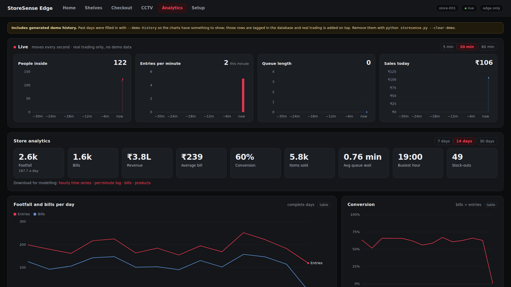

# StoreSense Edge

On-device retail intelligence for Indian stores. Ordinary cameras (old phones, CCTV, webcams) watch footfall, shelf stock, queues and the checkout — all on one edge box in the store, with no cloud dependency and no stored personal data.

Built for **Smart India Hackathon 2026 — PS SIH26179** (AI-powered retail intelligence with edge AI).



## What's in it

The dashboard has six tabs:

| Tab | What you do there |
|---|---|
| **Home** | Live KPIs (inside now, entries, sales today, conversion, queue wait), alerts that say what to do, products running low, floor heatmap, footfall by hour |
| **Shelves** | Draw a box around each product on the shelf picture, attach the product (SKU, barcode, brand, MRP, price), say how many sit side by side, how deep they stack and how big one unit is (that turns on depth counting). Live per-product stock table and a depth view. Product catalog with printable barcode labels |
| **Checkout** | Self-checkout / billing counter: scan with a USB barcode scanner, a checkout camera, or type a SKU or name. Cart with quantities, savings vs MRP, and a bill as PNG and PDF — "please move to the payment counter" |
| **CCTV** | Every camera as a plain security view with people boxes and counts (faces blurred here too), or with analytics overlays |
| **Analytics** | A live strip that moves every second (people inside, entries per minute, queue, sales today), then footfall and bills per day, conversion, a weekday × hour busyness heatmap, footfall and revenue by hour, top products, stock-outs, basket sizes, queue waits — plus CSV exports for forecasting models |
| **Setup** | Top-down store plan: drag shelves, cameras, doors (entry / exit), checkout counters and other fixtures (pillar, freezer, promo stand — they block camera views like shelves do), see which shelf faces each camera covers and where the blind spots are; set a camera's entry line, queue area and floor points by clicking on its picture; orbitable 3D view |

## Why it's different

- **Products, not grid cells.** You mark each product block on the shelf picture — a box can be as narrow as a single item, so taking one out registers. Each box is split into its facings (units side by side), and each knows its row and column on the shelf, so an alert reads *"Maggi Masala Noodles 70g — Aisle A, row 1 · col 1 low — about 12 of 24 left."*
- **Counts units behind the front row — with one ordinary camera, at any angle.** When the front unit of a column is taken, the next one is still there, just further back. A monocular depth model (Depth Anything V2, metric indoor) estimates distance for every pixel; StoreSense turns that into 3-D points, finds the plane of the product fronts on the full shelf, and gives every column a "tube" going back from it. The nearest solid surface in the tube, divided by the size of one unit, is how many are gone. See [How depth counting works](#how-depth-counting-works).
- **Honest about what it can't see.** From some angles a deep gap is hidden by the units beside it. Those columns are marked hidden (the front unit is known to be gone; the rest isn't guessed). Products without a unit size fall back to an estimate — facings still visible × how deep they stack — labelled as one. Where the till is used, stock is also tracked exactly: calibrating sets the level, each sale decrements it. Both numbers are shown side by side.
- **Model your store, don't match a template.** Shelves and cameras go anywhere on the plan. Which shelf face a camera watches is computed from its position, lens angle, range and line of sight, so blind spots show up before you mount anything.
- **Wrong product in a box is caught.** Each product box remembers its product's colours from the calibration picture; if something else ends up there, it's flagged "wrong product" with an alert — separately from low stock, so taking items out never looks like a planogram error.
- **Shopper attention per product.** The shelf camera times how long people stand in front of each product box (stops under 1.5 s are walk-pasts and don't count). Shown per product on the Shelves tab and as a chart in Analytics, next to dwell per store zone.
- **Occlusion-aware.** When a shopper stands in front of a product, that box keeps its last reading instead of raising a false "empty".
- **Checkout that works with what a shop has.** A basic USB barcode scanner, a phone pointed at the counter, or typing. Products without a barcode get an in-store EAN-13 from the GS1 20–29 range reserved for exactly this, with a printable label.
- **Runs offline, private by design.** Detection, storage, billing and the dashboard all run on the edge box. Only anonymous track IDs and numbers are stored — no frames, no faces. Heads are blurred on every view, including CCTV, and model telemetry is disabled.

## Quick start

```bash
pip install -r requirements.txt
python storesense.py              # laptop webcam as entry + queue camera
```

Open http://localhost:8000. The YOLO weights (~5 MB) download on the first run.

### Inventory: shelf and storeroom

Inventory uses the same local `storesense.db` and product catalog as checkout. The API
adds quantities, thresholds, an event history, and a single active decision per
product. A low shelf with available storeroom stock raises `SHELF_REFILL`; low stock
in both places raises `REORDER_REQUIRED`; a healthy shelf with low storeroom stock
raises `STOREROOM_LOW`. These appear in the existing alert list and in
`/api/state` and `/ws` under `inventory`. Raising stock above thresholds resolves
the alert. Repeated camera readings with the same quantity create no extra event.

Marked shelf camera slots linked to an inventoried SKU update shelf quantity through
the inventory service. Occluded and misplaced readings are ignored. The existing
shelf grid and alerts continue to work for products without inventory records.

Start the app with `python storesense.py`, then use these examples in another shell
(PowerShell):

```powershell
$base = 'http://localhost:8000/api/inventory'
$p = Invoke-RestMethod -Method Post -Uri "$base/products" -ContentType 'application/json' -Body '{"sku":"COKE-500","name":"Coca Cola 500ml","shelf_quantity":30,"shelf_capacity":40,"shelf_low_threshold":10,"storeroom_quantity":100,"storeroom_low_threshold":20}'
$id = $p.id
Invoke-RestMethod -Method Patch -Uri "$base/products/$id/shelf" -ContentType 'application/json' -Body '{"quantity":7,"source":"camera"}'
Invoke-RestMethod -Method Patch -Uri "$base/products/$id/storeroom" -ContentType 'application/json' -Body '{"quantity":10,"source":"employee"}'
Invoke-RestMethod -Method Post -Uri "$base/products/$id/transfer-to-shelf" -ContentType 'application/json' -Body '{"quantity":5,"source":"employee"}'
Invoke-RestMethod -Uri "$base/status"
Invoke-RestMethod -Uri 'http://localhost:8000/api/state'
```

The inventory API also provides `GET /products`, `GET /products/{id}`,
`PATCH /products/{id}` for name and thresholds, `GET /events`, and
`GET /products/{id}/events`. All paths above are under `/api/inventory`.
Run `python scripts/test_inventory.py` for five isolated scenarios without a camera,
or `python -m unittest discover -s tests -p test_inventory.py -v` for automated tests.

Inventory SQL is isolated in `inventory/database.py`, sharing StoreSense's SQLite
connection and lock. A future PostgreSQL or MySQL repository can replace it while
leaving the service, rules, and routes intact; no database migration is performed now.

### Full demo, no cameras needed

```bash
python storesense.py --config demo/demo_config.json --demo-history 14
```

This runs the demo store plan (`demo/demo_layout.json`) with looping videos for the entry camera, a shelf camera with nine products marked on it, and a self-checkout camera that holds up three barcoded products. Open **Shelves** and press **Calibrate** once — the shelf video then alternates between full and two partly-emptied products, so you can watch them go LOW and recover.

`--demo-history 14` fills the Analytics tab with 14 days of **generated** past trading so the charts have something to show. Every generated row is tagged in the database, the Analytics tab shows a banner while any are present, and real trading is added on top. Remove them with:

```bash
python storesense.py --config demo/demo_config.json --clear-demo
```

### Real cameras (phones)

Install **IP Webcam** (Android) on the phones, start its server, and put the laptop on the same Wi-Fi or hotspot. Then either pass cameras on the command line:

```bash
python storesense.py \
  --cam entry  entry,queue  http://192.168.1.23:8080/video \
  --cam shelfA shelf        http://192.168.1.24:8080/video \
  --cam till   checkout     http://192.168.1.25:8080/video
```

or add them in **Setup**: select the camera, type its source, **Save plan** — it connects straight away, and the panel shows **● live** or, in plain words, why it isn't. A source can be a webcam index, a phone's address, an HTTP/RTSP stream or a video file. For a phone you can type just `192.168.1.24:8080` — `http://` and `/video` are added for you. Camera jobs: count people and watch queue (can share a camera), watch shelves, self-checkout.

Phone streams are read with a latest-frame-only reader (old frames are dropped, never queued), frames are shrunk to 1280 px wide, and the dashboard asks for each new picture only after the last has arrived — so a slow link drops frames instead of lagging. For less load, set the phone app to 1280×720 and ~50% JPEG quality.

If a phone won't connect: open its address in the laptop's browser first. If that doesn't load either, the network is the problem — campus and office Wi-Fi usually block devices from reaching each other, so put the phones and laptop on a phone hotspot instead.

## Setting up a store

1. **Plan** (Setup tab): set the store size, drag in shelves and cameras, tick which shelf faces to monitor, give each camera its source, **Save plan**. Cameras start, restart or stop as soon as the plan is saved.
2. **Point the cameras** (Setup tab, select a camera): click on its picture to place the **entry line** (flip the in/out direction with one button), the **queue area**, and four **floor points** that tie it into the store heatmap.
3. **Calibrate shelves** (Shelves tab): fill the shelf, clear the aisle, press **Calibrate**.
4. **Mark products** (Shelves tab): **Draw product box** around each product block, choose the product or create it, set facings, how many deep, and the size of one unit front to back (cm) — the last one turns on depth counting for that product. **Save products**. Editing boxes later needs no re-calibration. After calibrating, leave the shelf untouched for ~20 s while the depth reference is measured.
5. **Products and labels** (Shelves tab, catalog): add products, print barcode labels for anything without one.

All settings live in `CONFIG` at the top of `storesense.py`; a JSON file passed with `--config` is merged over it.

## How depth counting works

1. **Calibrate** with the shelf full. The depth model runs on the full-shelf picture a few times; the median is the reference.
2. The reference is turned into 3-D points (using the camera's field of view from the store plan). A plane is fitted through the product fronts, and each column's front face becomes a small patch on it — the mouth of that column's tube.
3. **Every few seconds** a new depth pass is aligned to the reference on the parts that shouldn't change (shelf frame, walls, floor). A monocular model's scale drifts a few percent between frames — at 1.5 m that's a whole unit — so this re-anchoring is what makes centimetre differences usable.
4. For each column, the nearest dense surface inside its tube is found (the rim of a gap is smeared by the model, so isolated near points are ignored). Distance behind the full front ÷ unit size = units gone. Median of the last few passes.
5. If nothing solid is visible in a tube — the neighbours hide it from this angle — the column is reported **hidden**: the front unit is known gone, the rest isn't guessed. Someone standing in front: the last reading holds.

Check the model on your own shelf before trusting it: take two photos from the same spot, full and with a few front units removed, and run

```bash
python storesense.py --depth-test full.jpg taken.jpg
```

It prints the fit error and how far back the changed area moved, and writes `depth_test.png`. On Qualcomm hardware the same model family is available from [Qualcomm AI Hub](https://aihub.qualcomm.com/models/depth_anything_v2) for the Hexagon NPU.

**Tested:** on a ray-traced shelf with known true depth, with the model replaced by true depth plus scale/offset drift, blur, low-frequency error and noise (`tests/test_depth.py`): from straight on, 18° to the side and 14° from above, every column the camera could see was counted exactly; up to two columns per view were correctly reported hidden. **Not yet tested:** the real model on a real shelf — thin products (under ~3 cm deep) and shiny or transparent packs are the likely weak spots.

## Integrations (POS, inventory, ERP)

| Call | What it does |
|---|---|
| `POST /api/integrations/pos` | Record a sale made on another till |
| `POST /api/integrations/products` | Import the catalog — JSON list or CSV (`sku,name,brand,barcode,mrp,price`); also the **Import CSV** button in Shelves → catalog |
| `POST /api/integrations/restock` | A delivery arrived: `{"items":[{"sku":"…","qty":12}],"mode":"add"\|"set"}` |
| `GET /api/integrations/stock` | Every product: where it sits, camera count, till count, status, wrong-product flag |
| `GET /api/integrations/sales?since=<unix time>` | Bills since a time |
| Webhooks | Set `"webhooks": ["https://…"]` in the config (or `{"url": …, "events": [...]}`). Events `alert`, `bill`, `stock` (a product's shelf status changed), `restock` are POSTed as JSON, queued in SQLite and retried — nothing is lost while offline |

These are generic REST/JSON; a specific ERP (Tally, SAP, Zoho…) needs a small adapter that calls them.

## Data for forecasting

The Analytics tab links these downloads (also at `/api/export/{name}.csv`):

| File | Rows | Use |
|---|---|---|
| `timeseries_hourly.csv` | one per hour: entries, exits, bills, revenue, items, average occupancy, average queue wait, stock alerts, weekday, `demo` flag | training table for a recurrent/sequence model of footfall and sales |
| `timeseries_minute.csv` | one per minute while running (also written to `analytics/timeseries.csv`) | fine-grained live log |
| `bills.csv` | one per bill | basket and revenue analysis |
| `products.csv` | the catalog | |

Filter on the `demo` column to keep generated history out of a model.

## Architecture

```
store plan (metres) ─► coverage solver: which camera sees which shelf face
        │
cameras ─► capture threads (latest frame only)
        ├─ PeopleWorker   : YOLO + ByteTrack ─► entry/exit line, store-frame heatmap, queue
        ├─ ShelfWorker    : person mask + per-facing edge compare vs calibrated picture ─► product boxes
        └─ CheckoutWorker : multi-scale barcode decoding ─► open cart
                  │
                  ▼
   Engine: priority alerts (dedupe, auto-resolve) · carts & bills · stock levels
                  │
   SQLite (events, metrics, products, bills, outbox) · bills/ (PNG+PDF) · analytics/ (CSV)
                  │
   FastAPI ─► six-tab dashboard over WebSocket, MJPEG feeds, REST, CSV exports
```

One Python file. It runs on any laptop for development. The deployment target is Qualcomm edge hardware: the Dragonwing RB3 Gen 2 (QCS6490) Vision Kit, or a Snapdragon phone for small stores. The detector is exported with `model.export(format="qnn")` to run on the Hexagon NPU.

## Tests

```bash
python tests/test_logic.py    # counting, queue, shelf grid, alerts, API, offline sync
python tests/test_layout.py   # store plan geometry, coverage, store-frame mapping, 3D render
python tests/test_pos.py      # catalog, carts, bills, checkout camera, product boxes, stock counts
python tests/test_depth.py    # depth counting on a ray-traced shelf from three camera angles
python tests/test_cams.py     # camera hot-start/stop, phone URL fixing, stream lag, live view
python tests/test_real.py     # real YOLO on a generated walk-through video
```

### USDZ room-model processing (developer preview)

The room-model processor is an independent Python package in `room_model/`.
It does not change the live dashboard or the existing layout JSON. A future
upload endpoint can save a file and call the same function:

```python
from room_model import process_room_model

result = process_room_model(saved_usdz_path)
# Return result from an API route after the upload handler saves the file.
```

Install the Python dependencies and **Blender 4.0 or newer**. Blender must be
available as `blender` on `PATH`, or set `BLENDER_EXECUTABLE` to its executable:

```powershell
python -m venv .venv
.\.venv\Scripts\python -m pip install -r requirements.txt
$env:BLENDER_EXECUTABLE = "C:\Program Files\Blender Foundation\Blender 4.5\blender.exe"
.\.venv\Scripts\python scripts/test_room_model.py C:\path\to\room.usdz
.\.venv\Scripts\python -m unittest discover -s tests -p test_room_model.py
```

On Linux/macOS, use `python3 -m venv .venv`, `.venv/bin/python -m pip install -r requirements.txt`,
and either put `blender` on `PATH` or `export BLENDER_EXECUTABLE=/path/to/blender`.
Run the script with `.venv/bin/python scripts/test_room_model.py /path/to/room.usdz`.
The override is optional on Windows too: common Blender Foundation install
folders are searched automatically. The manual script requires an actual,
non-empty `.usdz` scan. It prints conversion status, OBJ and preview paths,
vertex and face counts, and dimensions.

Each successful call creates `storage/room_models/<model_id>/model.obj` and
`preview.png`; generated files are ignored by Git. The returned metadata
contains the source and output paths, vertex and face counts, axis-aligned
bounds, dimensions, and bounds center. Values remain in the model's source
units; no floor, wall, scale calibration, or alignment with the dashboard
layout is inferred yet. Blender exports triangulated, Z-up geometry without
UVs or materials. Trimesh combines OBJ objects and instances with their
transforms. Matplotlib renders a debug PNG from at most 20,000 faces; the
full OBJ and mesh geometry are unaffected.

## Status

**Working:** everything above, tested on generated video and with the real detector; barcode reading tested on generated labels under blur, rotation and noise.

**Not yet validated in a real store:** product-box detection under real shelf lighting, the floor mapping on a real floor, queue forecasts against real queues, and barcode reading on real packaging at a real counter.

**Limits to be upfront about:** depth counting depends on a monocular model and has not yet been validated on a real shelf; deep gaps can be hidden from a camera at an angle (reported, not guessed); if staff pull stock forward, the camera sees a full front row again — the till count catches that. The till count is exact only for products sold through this checkout.

**Roadmap:** cross-checking a shelf face seen by two cameras; a trained SKU model for planogram checks (SKU-110K fine-tune); a multi-store HQ view; porting to Qualcomm hardware and benchmarking on RB3 Gen 2 / Snapdragon.

## API

| Method | Path | Purpose |
|---|---|---|
| GET | `/` | Dashboard |
| GET | `/api/state` · WS `/ws` | Full live state (pushed once a second) |
| GET/POST | `/api/layout` | Store plan, with per-face coverage |
| GET/POST | `/api/slots/{cam}` | Product boxes on a shelf camera |
| GET | `/api/shelf/{cam}/still.jpg` | Calibrated shelf picture to mark products on |
| GET | `/api/depth/{cam}.jpg` | Latest depth pass with each column's count |
| POST | `/api/calibrate/{cam}` | Capture the shelf reference |
| GET/POST/DELETE | `/api/products` · `/api/products/{sku}` | Product catalog |
| GET | `/api/products/{sku}/label.png` | Printable EAN-13 label |
| POST | `/api/cart` · `/api/cart/{id}/scan` · `/set` · `/checkout` | Carts and billing |
| GET | `/api/bills/{id}.png` · `.pdf` | Bill |
| GET | `/api/analytics?days=` | Everything the Analytics tab draws |
| GET | `/api/export/{name}.csv` | CSV exports |
| GET | `/video/{cam}?view=cctv` | Live feed (plain CCTV or analytics overlay) |
| POST | `/api/integrations/pos` | Record a sale from an external POS |
| GET | `/api/report?period=day\|week` | Summary report |
| POST | `/api/alerts/{id}/ack` · `/api/counters?open=N` | Staff actions |
